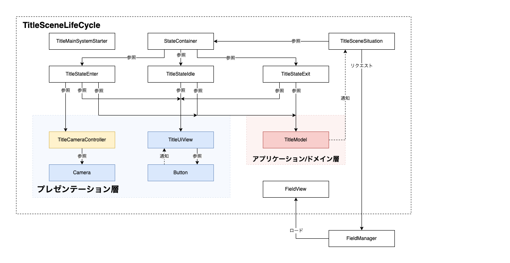
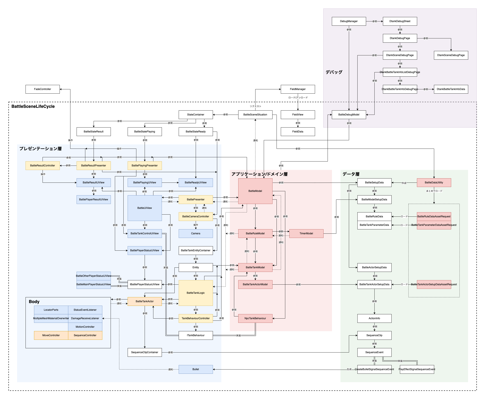

# dokkan-tank

「ドッカン戦車」というゲームの制作を通して、[game-framework](https://github.com/DaitokuAmy/game-framework)の思想を学習/実践するためのリポジトリ

## クラス関係図

### Title

### Battle

## 利用しているパッケージ

- [game-framework](https://github.com/DaitokuAmy/game-framework.git)
- [action-sequencer](https://github.com/DaitokuAmy/action-sequencer.git)
- [UnityDebugSheet](https://github.com/Haruma-K/UnityDebugSheet.git)
- [UniRx](https://github.com/neuecc/UniRx.git)
- [UniTask](https://github.com/Cysharp/UniTask.git)
